# Sketch Plugins

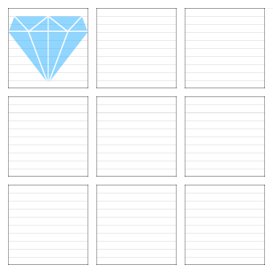

An assortment of Sketch Plugins aimed towards working with grids/layouts and typography.

There are also some additional plugins for generating colour palettes.

- [Installation](#installation)
- [Compatibility](#compatibility)
- [Avoiding Crashes](#avoiding-crashes)
- [Keyboard Shortucts](#how-do-i-use-a-plugin-as-a-keyboard-shortcut)

## Plugin Previews
- [Horizontal Alignment](#horizontal-alignment-alpha)
- [Vertical Alignment](#vertical-alignment)
- [Grid](#grid)
- [Typography](#typography)
- [Colour](#colour)

## General Info

I have heavily commented these plugins so that others can learn (and also to refresh
my memory on how to write JSTalk in x weeks/months/years time)

If you have any suggestions for plugin ideas then feel free to open an issue.

**Please read the [Avoiding Crashes](#avoiding-crashes) section of this README for a less frustration-inducing experience
with Sketch and Plugins in general.**

## Installation

To install all plugins, [download](https://github.com/alessndro/sketch-plugins/zipball/master) them all first, unzip the archive, and place the folder contents in the root of your Sketch Plugins directory ``~/Library/Containers/com.bohemiancoding.sketch3/Data/Library/Application Support/sketch/Plugins``

To install only a selection of plugins, you will first need to download and place the library file [alessndro_library.js](alessndro_library.js) in the root of your Sketch Plugins directory. This is very important as all plugins rely on its functionality.

Then, download your selected plugins and double-click the file, or alternatively, drag and drop the file onto the Sketch app icon. This will automatically copy the plugin to your Sketch Plugins folder.

Further instructions can be found on the official [Sketch Plugin help page](http://bohemiancoding.com/sketch/support/developer/01-introduction/01.html).

## Compatibility

All plugins are developed and tested in Sketch 3, however, the official Sketch Plugin documentation
states that [the API is backwards compatible with Sketch 2.](http://bohemiancoding.com/sketch/support/developer/03-reference/00.html)

## Avoiding Crashes

This section contains some quick tips about how to avoid Sketch crashing when activating the same Plugin in quick succession. And by quick I mean multiple-times-a-second quick.
This really only applies to plugins assigned to keyboard shortcuts.

### Why don't you just write plugins that don't crash?

Unfortunately it's not that simple, and I'm 99% sure that crashes aren't caused by plugins themselves, but are a [JSTalk](http://jstalk.org)/Sketch issue.

How do I know this? Well, create the simplest plugin you can imagine, a ``.sketchplugin`` file that contains only one line:

`` doc ``

All this does is access the ``doc`` variable, which returns a ``MSDocument`` object representing the currently open document in Sketch.

Assign this plugin to a Keyboard Shortcut, open Sketch and hammer away at your newly created Shortcut. If you activate
the shortcut quickly enough, Sketch will crash. Every time.

### Avoiding crashes when using plugins you expect to activate repeatedly

This obviously becomes a big issue since the majority of the alignment-based plugins will likely be assigned to a keyboard
shortcut and activated multiple times in quick succession as you move elements around/resize them.

The best advice I can give is to figure out the 'crash' threshold. We're going to make Sketch crash, so open a blank document, draw
a rectangle, select it, and repeatedly press the keyboard shortcut of the plugin you want to figure out the threshold for.

Start at a slow rate, then gradually increase how fast you press the shortcut.
Eventually Sketch will crash and you will now have a rough idea of how quickly you can activate the plugin before Sketch will crash.

## How do I map a plugin to a keyboard shortcut?

First install the plugin. Then in OS X navigate to Settings > Keyboard > Shortcuts. In the left hand menu select "App Shortcuts", select "All Applications" in the right hand menu and click the plus icon.

A new menu will appear allowing you to select Sketch as the Application, enter the name of the plugin under Menu Title, and finally the shortcut you'd like to use.

## Plugin Previews

Simple descriptions of (most) plugins.

## Horizontal Alignment (alpha)

All plugins require the use of a columnal Layout Grid, created using ``View > Grid Settings... > Layout Grid``.

----

**These plugins are still at an early stage and can be quite buggy, so use with caution.**

**There is a chance that these plugins may not work with your Grid Layout. The easiest way to test this is to set up your Layout Grid, then activate the [Draw Grid As Guidelines](#draw-grid-as-guidelines-alpha) plugin. This plugin converts your Layout Grid to Ruler guides. If the resulting Ruler Guides are in EXACTLY the same position as your Layout Grid columns, the Horizontal Alignment should work correctly.**

----

### Align (Left | Right) Edge to Column

Aligns the (left | right) edge of the selected elements to nearest column.

(Align Left Edge to Column shown)

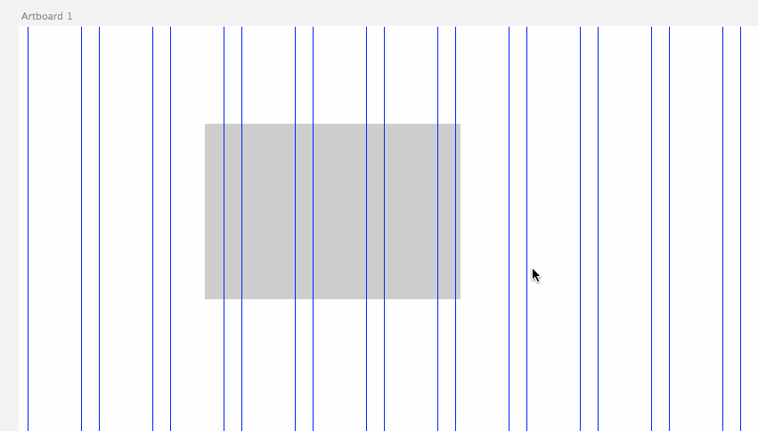

----

### Align (Left | Right) Edge to Next Column

Aligns the (left | right) edge of the selected elements to the next column.

(Align Left Edge to Next Column shown)

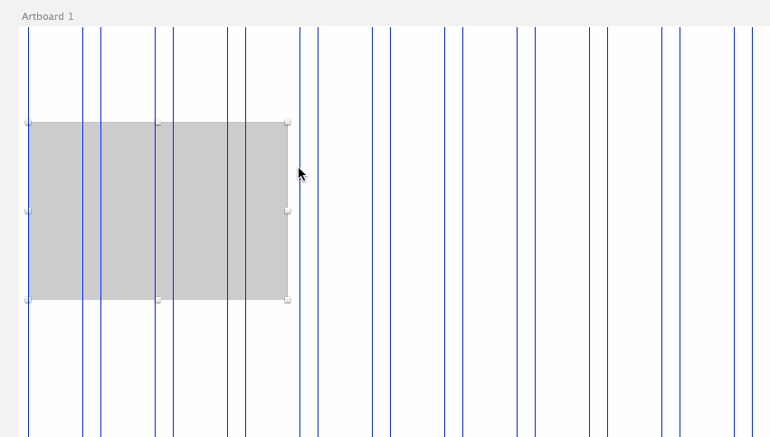

----

### Align (Left | Right) Edge to Previous Column

Aligns the (left | right) edge of the selected elements to the previous column.

(Align Left Edge to Previous Column shown)

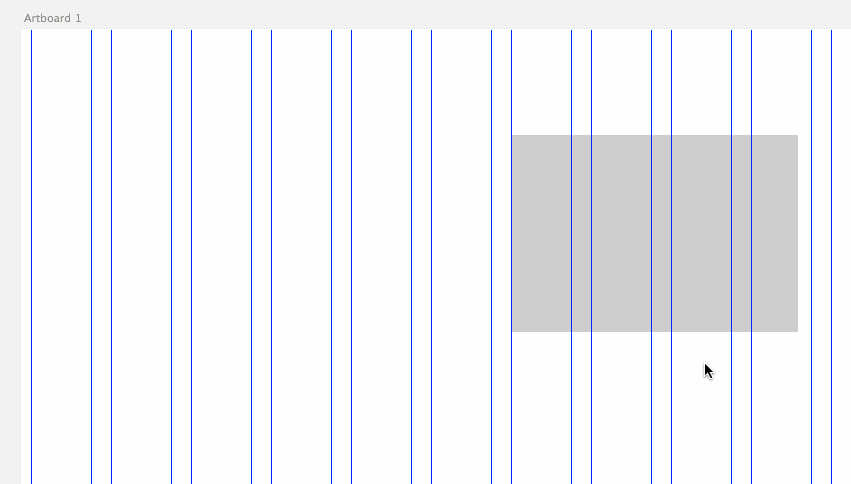

----

### Resize & Align to Column

Resizes and aligns selected elements to fit the horizontal grid.

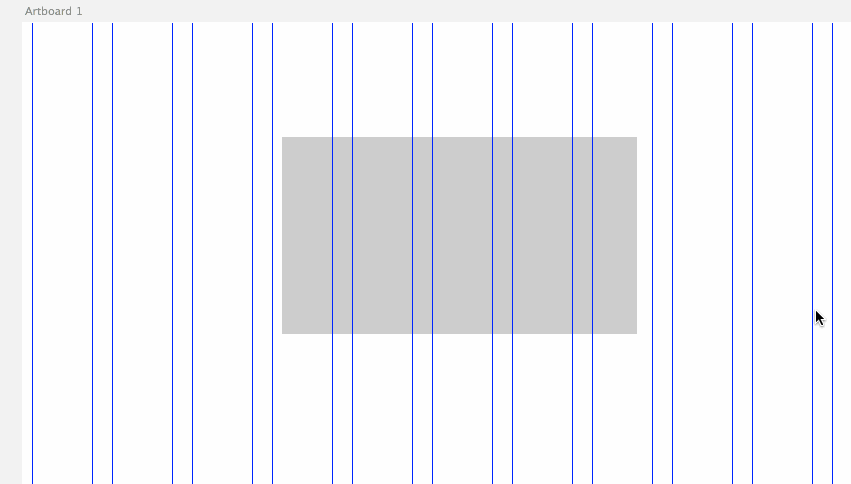

----

### Expand to Next Column

Expands selected elements to the next column.

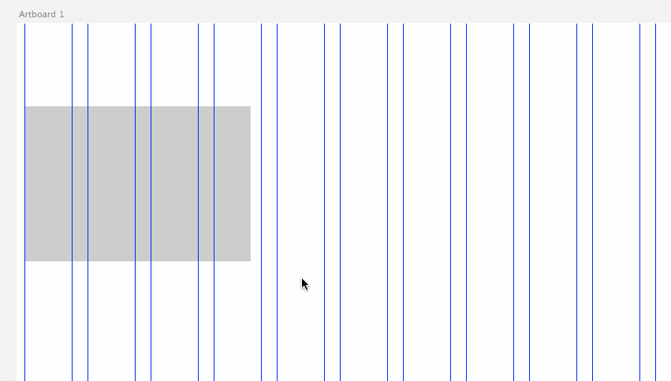

----

### Shrink to Previous Column

Shrinks selected elements to the previous column.

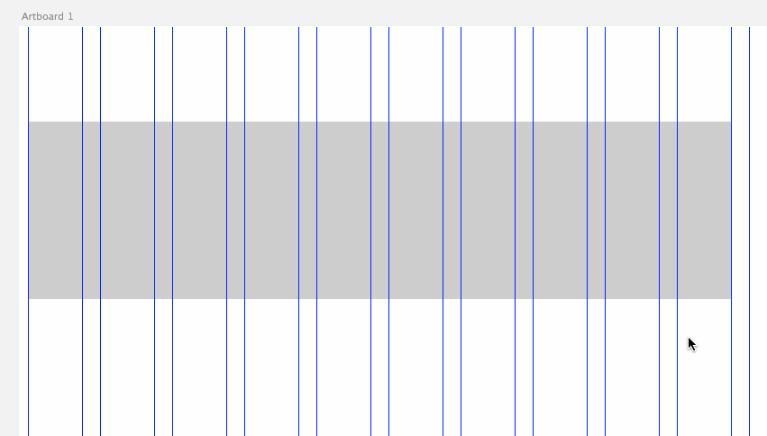

----

# Vertical Alignment

All of these plugins revolve around sizing/aligning elements vertically to a Baseline Grid.

You will need to have at least 2 vertical guides on your Artboard in order for the
plugin to calculate the intervals of your Baseline Grid.

The easiest way to establish a Baseline Grid is to use the ``Draw Baseline Grid Guides`` plugin.

The plugins are quite clever in that they will align/resize elements to the closest
grid line.

### Draw Baseline Grid Ruler Guides

After entering the desired interval, the plugin will automatically draw vertical Ruler guides on the current Artboard, up to the height of the Artboard. 

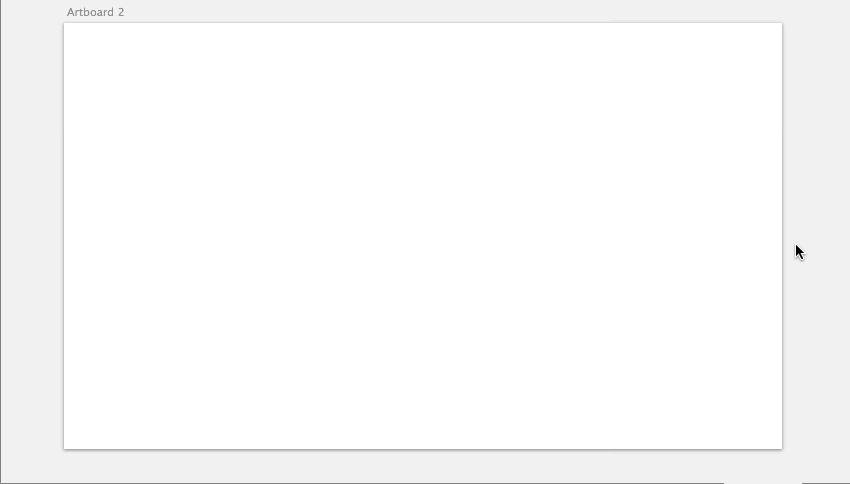

----

### Clear All Ruler Guides

Clears all Ruler guides on the current Artboard.

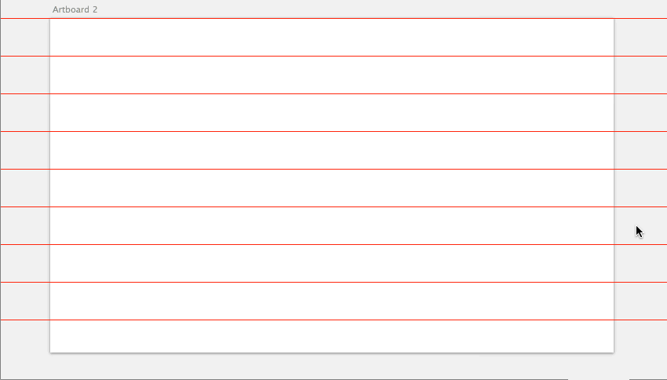

----

### Resize and Align to Baseline Grid

Resizes and aligns currently selected elements to fit the Baseline Grid of the current Artboard.

----

Works on multiple elements too:

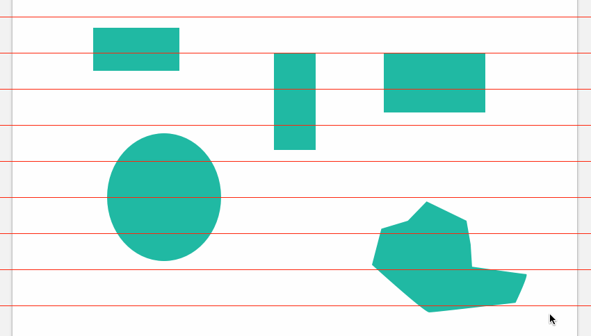

----

### Resize to Baseline Grid

Resizes currently selected elements to fit the Baseline Grid of the current Artboard.

----

### Expand to Baseline Grid

Expands the currently selected elements by a single Baseline Grid interval.

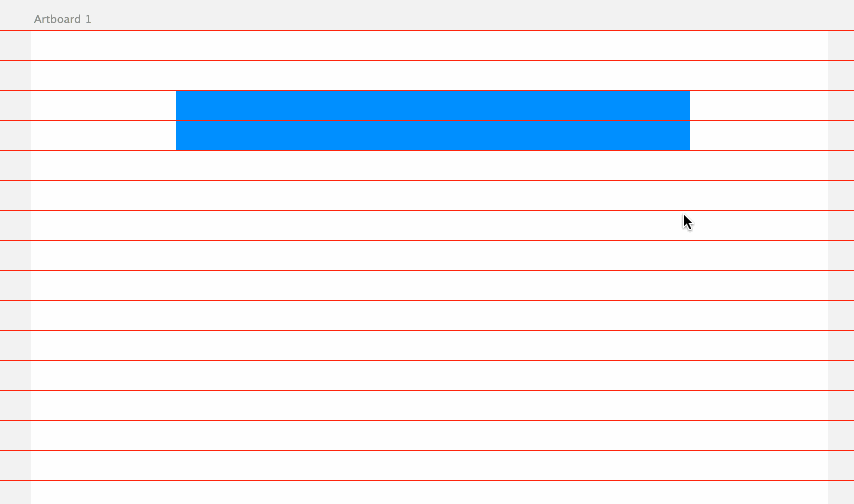

----

### Shrink to Baseline Grid

Shrinks the currently selected elements by a single Baseline Grid interval.

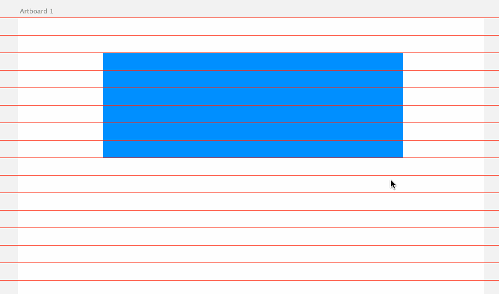

----
For text layers it sets the line height to fit the Baseline grid instead.

**This does not align the the text to the Baseline Grid (the gif is a bit deceptive). This is
because the Sketch Plugin API does not (currently) allow for the retrieval of the baseline of the text itself. After running the plugin you will have to move the text layer to fit on the baseline manually.**

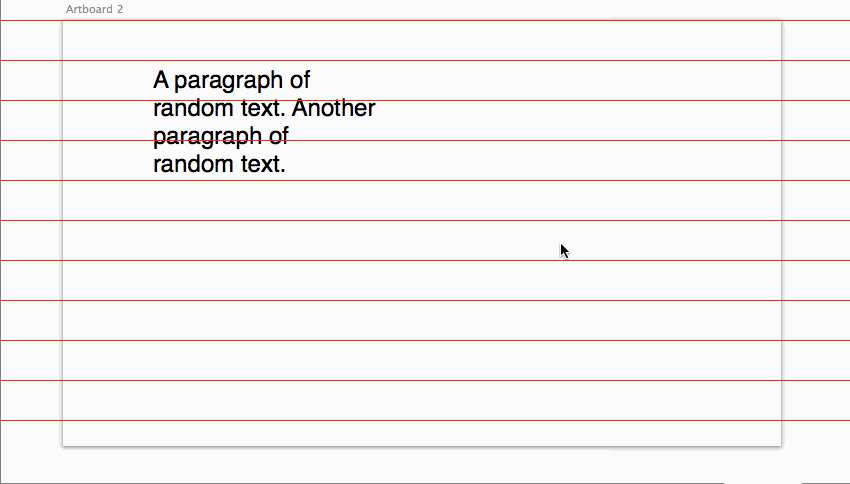

----

Also works for text larger than the interval of the Baseline Grid:

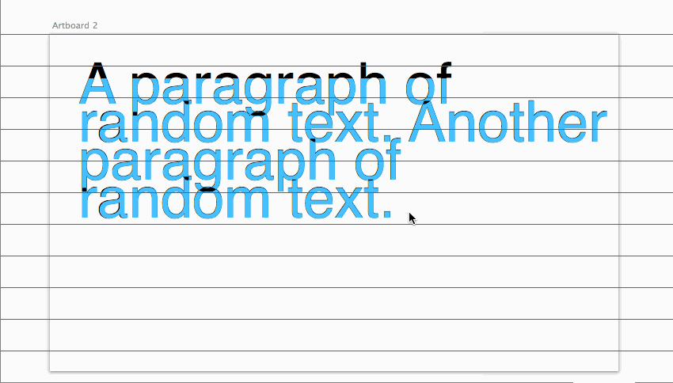

----

### Align Top to Baseline Grid

Aligns the top of the currently selected elements to the Baseline Grid of the current Artboard.

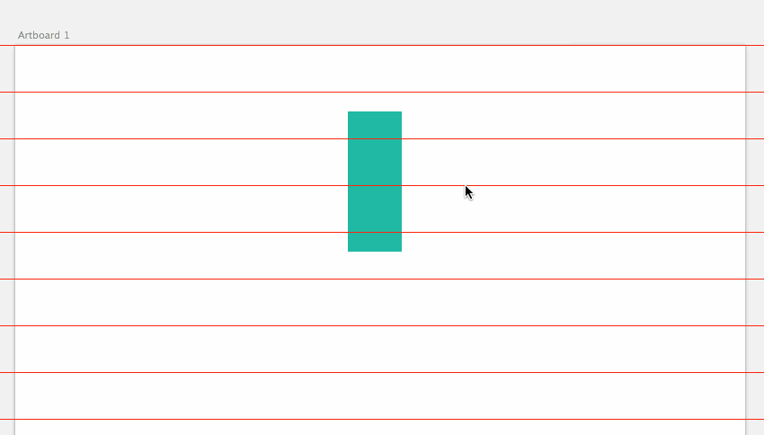

----

### Align Bottom to Baseline Grid

Aligns the bottom of the currently selected elements to the Baseline Grid of the current Artboard.

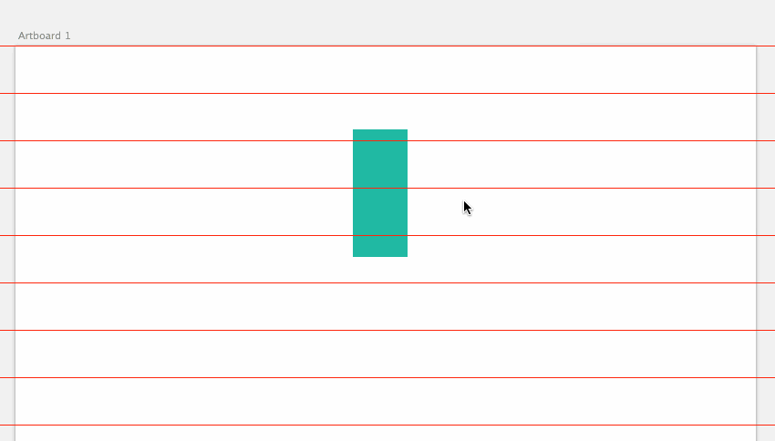

----

### Align Top to Next Baseline Grid Line

Aligns the top of the currently selected elements to the next Baseline Grid Line of the current Artboard.

(plugin used multiple times in preview gif)

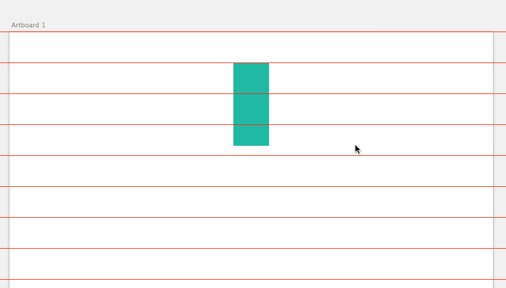

----

### Align Top to Previous Baseline Grid Line

Aligns the top of the currently selected elements to the previous Baseline Grid Line of the current Artboard.

(plugin used multiple times in preview gif)

----

### Align Bottom to Next Baseline Grid Line

Aligns the bottom of the currently selected elements to the next Baseline Grid Line of the current Artboard.

(plugin used multiple times in preview gif)

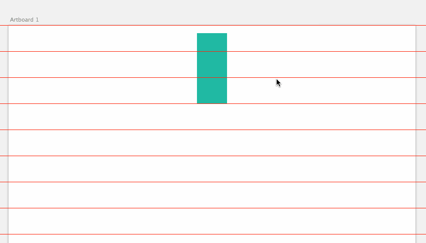

----

### Align Bottom to Previous Baseline Grid Line

Aligns the bottom of the currently selected elements to the previous Baseline Grid Line of the current Artboard.

(plugin used multiple times in preview gif)

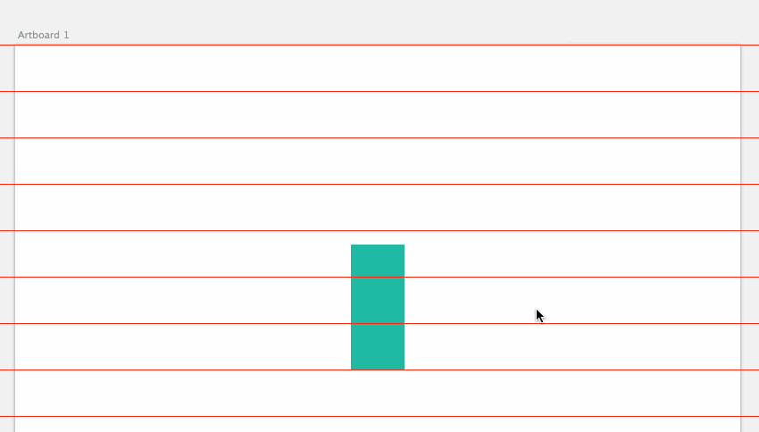

----

# Grid

### Draw Grid as Guidelines (alpha)

Draws Ruler guides that mimic the horizontal grid set using ``View > Grid Settings... > Layout Grid``.

*There are known issues with certain grid settings, hence alpha status.*

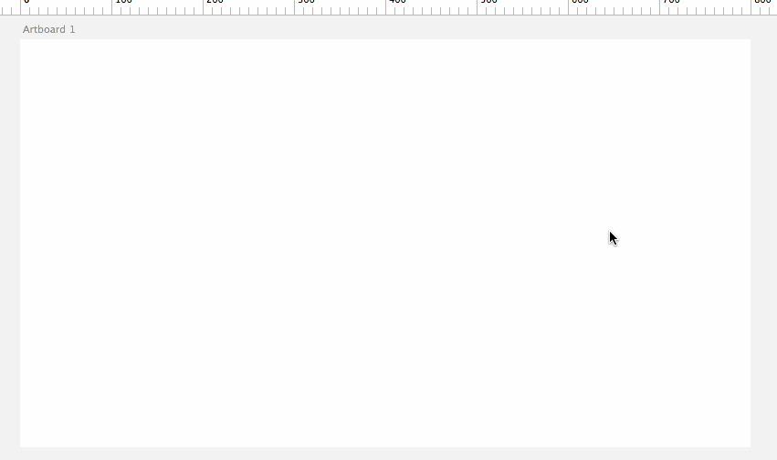

----

# Typography

### Draw Typographic Scale

First select a text layer to use as the base layer. This will be the base font size of your scale.

Then activate the plugin and choose the scale you would like to use. Scales are taken from [modularscale.com](http://modularscale.com).

Six new text layers will be drawn according to the scale. If you need more than six, simply select the largest layer and use the plugin again.

*Future Improvement: The plan is to create symbols instead of plain text layers once the Sketch Plugin API provides the ability to make new symbols.*

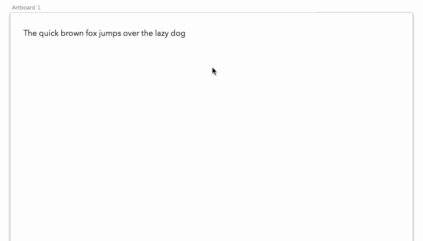

----

### Draw Custom Typographic Scale

Same as above, except you can enter a custom ratio.

*Future Improvement: The plan is to create symbols instead of plain text layers once the Sketch Plugin API provides the ability to make new symbols.*

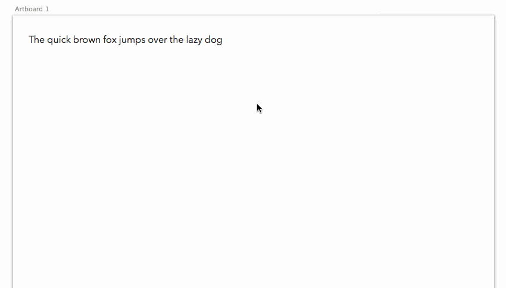

----

# Colour

### Create Random Colour Palette (Top)

First create a base shape layer that will be used to set the size of each colour in your palette.

Select the shape layer and activate the plugin. A new palette will be created at random, chosen from the
[Top 100 Palettes at Colourlovers](http://colourlovers.com/palettes/top).

Works on any shape.

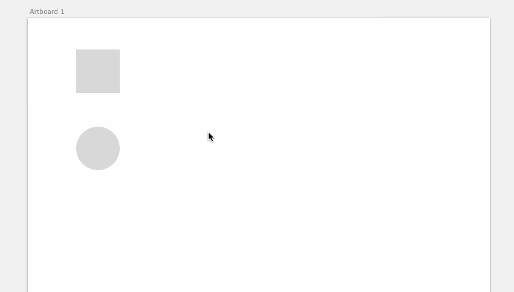

----

### Create Random Colour Palette (Random)

First create a base shape layer that will be used to set the size of each colour in your palette.

Select the shape layer and activate the plugin. A new palette will be created based on a random palette retrieved
from all palettes on Colourlovers.

Works on any shape.

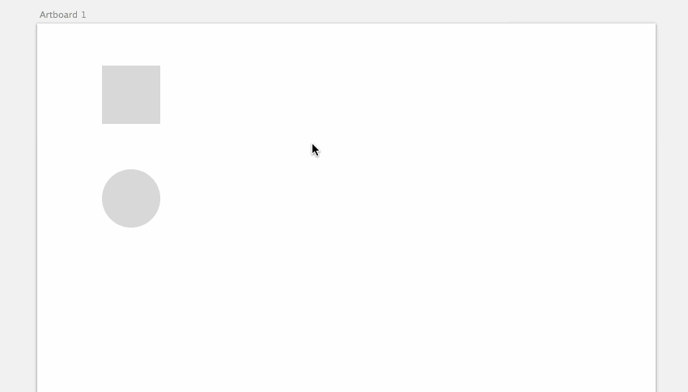

----

### Create Monochrome Colour Palette

Create a base shape layer that will be used as the base of your palette and activate the plugin.

Works on any shape.

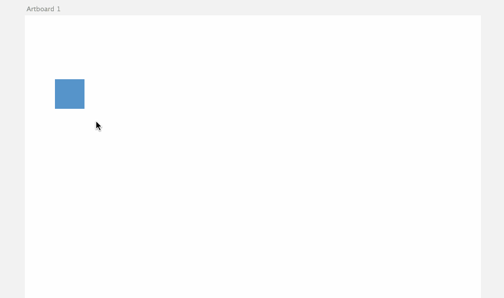

----

### Copy Hex Colour Value

Copies the Hex colour value of the selected element to the clipboard.

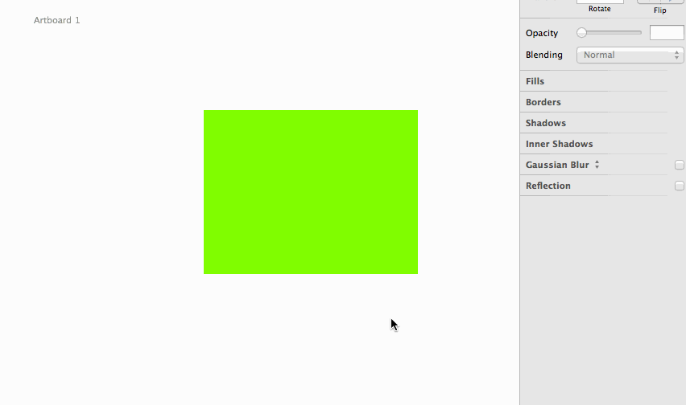

----
