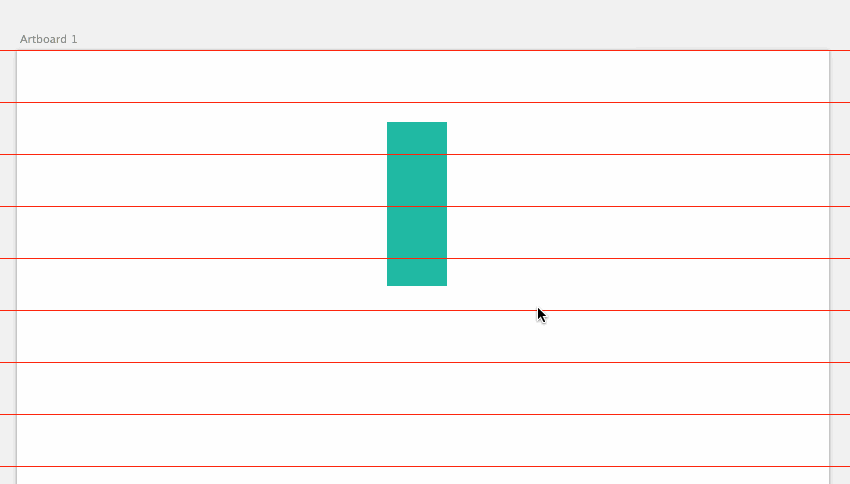
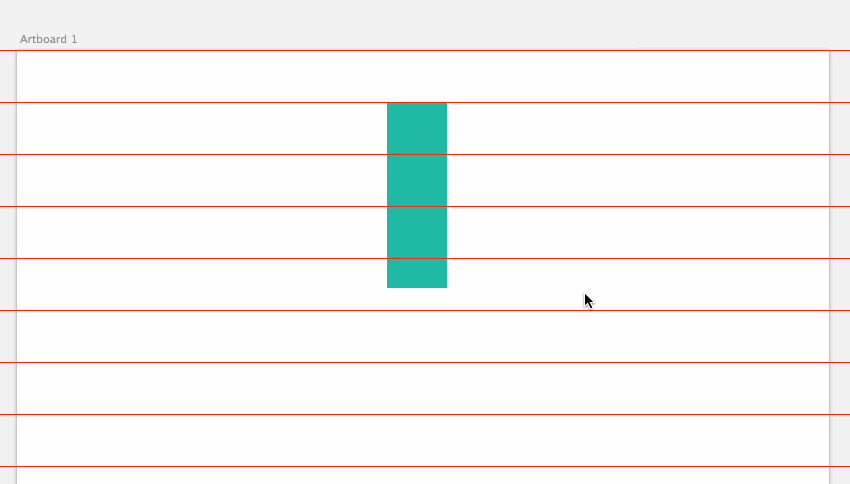

# Sketch Plugins

**This is a very new repository and these plugins are changing rapidly! Check back often to make sure you have the latest versions since I've likely fixed a lot of bugs**

A random assortment of Sketch plugins.

I have heavily commented these plugins so that others can learn (and also to refresh
my memory on how to write JSTalk in x weeks/months/years time!)

If you have any suggestions for plugin ideas then feel free to open an issue.

Warning: **Always** save often when using any plugins. I have noticed that assigning a plugin to a
keyboard shortcut and spamming it is a great way to make Sketch crash. So be careful when using a plugin
that you expect to use multiple times over a very short period of time (i.e. four times a second)

## Installation

To install all plugins, [download](https://github.com/alessndro/sketch-plugins/zipball/master) them all first, unzip the archive, and place the folder contents in the root of your Sketch Plugins directory ``~/Library/Containers/com.bohemiancoding.sketch3/Data/Library/Application Support/sketch/Plugins``

To install only a selection of plugins, you will first need to download and place the library file [alessndro_library.js](alessndro_library.js) in the root of your Sketch Plugins directory. This is very important as all plugins rely on its functionality.

Then, download your selected plugins and double-click the file, or alternatively, drag and drop the file onto the Sketch app icon. This will automatically copy the plugin to your Sketch Plugins folder.

Further instructions can be found on the official [Sketch Plugin help page](http://bohemiancoding.com/sketch/support/developer/01-introduction/01.html).

## How do I use a plugin as a keyboard shortcut?

First install the plugin. Then in OS X navigate to Settings > Keyboard > Shortcuts. In the left hand menu select "App Shortcuts", select "All Applications" in the right hand menu and click the plus icon.

A new menu will appear allowing you to select Sketch as the Application, enter the name of the plugin under Menu Title, and finally the shortcut you'd like to use.

## Plugin Previews

### Alignment

All of these plugins revolve around sizing/aligning elements to a baseline grid.

You will need to have at least 2 vertical guides on your Artboard in order for the
plugin to calculate the intervals of your baseline grid.

The easiest way to establish a baseline grid is to use the ``Draw Baseline Grid Guides`` plugin.

### Draw Baseline Grid Guides

After entering the desired interval, the plugin will automatically draw vertical guides on the current
Artboard, up to the height of the Artboard.

### Clear All Guides

Clears all guides on the current Artboard.

#### Resize and Align to Baseline Grid

Resizes and aligns currently selected elements to fit the Baseline Grid of the current Artboard

Works on multiple elements too:

#### Resize to Baseline Grid

Resizes currently selected elements to fit the Baseline Grid of the current Artboard

For text layers it sets the line height to fit the Baseline grid instead.

